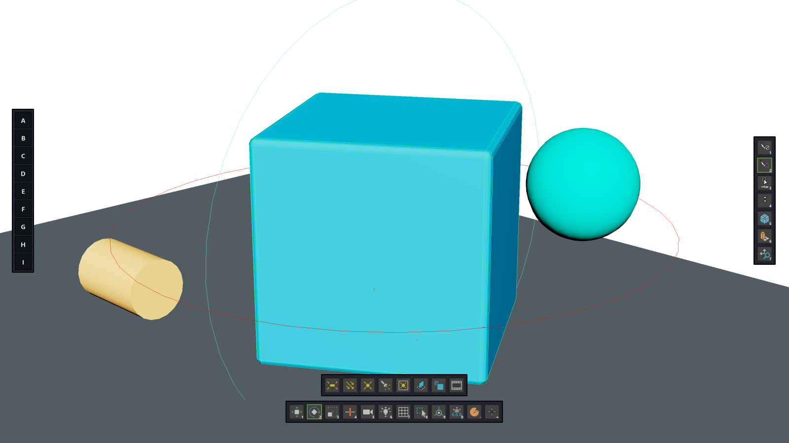

# ActionRail - Polished viewport UI for Maya


ActionRail is a Maya module for compact, polished, user-created viewport UI:
tool rails, action bars, action buttons, hotkey badges, diagnostics, and
authoring utilities. It is PySide6-first, data-driven, and built to feel like
part of Maya instead of a large docked tool window.

<p align="center">
  
</p>

## In Maya

<p align="center">
  
</p>

## Edit Mode Overview

<p align="center">
  
</p>

Edit Mode switches ActionRail from action execution into a layout-map view. It
shows active rails as labeled translucent frames over the viewport, with grid
controls, Snap to Grid, Sticky Frames, rail lock state, left-click selection,
and an X/Y position popover for unlocked rails. Slot payload editing happens in
Normal Mode by unlocking a rail, assigning or clearing slot payloads from the
rendered rail, then locking it again.

## Why

Maya has shelves, hotkeys, hotbox zones, marking menus, and dockable editors.
ActionRail fills a different slot: tiny viewport-adjacent controls that artists
and TDs can define as data, share as presets, and bind through Maya's native
command system.

The bundled presets are a compact transform stack with `M/T/R/S` and a
separate `K` set-key button, a first-party icon horizontal rail, and a
Maya-resource icon horizontal rail.

## Quick Start

Add this checkout to Maya's module path, then show a bundled preset from Maya's
Python environment:

```python
import actionrail

actionrail.show_preset("transform_stack")
```

Try the horizontal rails:

```python
actionrail.show_preset("horizontal_tools")
actionrail.show_preset("maya_tools")
```

Useful commands:

```python
actionrail.reload()
actionrail.hide_all()
actionrail.show_example("transform_stack")
actionrail.run_action("maya.tool.rotate")
actionrail.run_slot("transform_stack", "set_key")
```

Install Maya-native entry points:

```python
actionrail.install_menu_toggle()
actionrail.install_shelf_toggle()
actionrail.toggle_default()
actionrail.run_diagnostics_from_maya()
actionrail.toggle_edit_mode()
```

Inspect the current package map, presets, user preset directory, public APIs,
module ownership, and verification commands:

```powershell
$env:PYTHONPATH = "scripts"
.\.venv\Scripts\python.exe -m actionrail --json
```

For a local checkout, set the module path before launching Maya:

```powershell
$env:MAYA_MODULE_PATH = "."
```

## Authoring Utilities

Phase 2 authoring includes both code-facing draft helpers and Maya-facing
panels. Draft rails can be validated, converted into runtime specs, previewed,
saved as user presets, loaded back for editing, and inspected in Edit Mode
without touching locked built-in presets.

Bundled presets and saved user presets share the same resolver path through
`show_preset()`, `run_slot()`, diagnostics, and hotkey publishing. Bundled
presets stay read-only; user-created rails are written outside the checkout.

```python
import actionrail

draft = actionrail.DraftRail(
    id="artist_tools",
    layout=actionrail.RailLayout(
        anchor="viewport.bottom.center",
        orientation="horizontal",
        offset=(0, -32),
    ),
    slots=(
        actionrail.DraftSlot(
            id="move",
            label="M",
            action="maya.tool.move",
            key_label="W",
            active_when="maya.tool == move",
            icon="actionrail.move",
        ),
        actionrail.DraftSlot(
            id="set_key",
            label="K",
            action="maya.anim.set_key",
            tone="teal",
        ),
    ),
)

spec = actionrail.build_draft_spec(draft)
path = actionrail.save_user_preset(draft)
loaded = actionrail.load_user_preset("artist_tools")
actionrail.show_preset("artist_tools")
```

User presets default to `%APPDATA%\ActionRail\presets` on Windows. Override the
location with `ACTIONRAIL_USER_PRESET_DIR`, or pass `preset_dir=` to the user
preset helpers.

Open the dockable Quick Create panel from the ActionRail Maya menu or Python:

```python
actionrail.show_quick_create_panel()
```

Quick Create can create a vertical stack, horizontal strip, or edge-tab starter
draft; preview without saving; clear previews; save or explicitly overwrite a
user preset; and load an existing user preset back into editable values.

Use Edit Mode after showing rails:

```python
actionrail.show_preset("transform_stack")
actionrail.toggle_edit_mode()
```

Edit Mode can save unlocked runtime/user rail layout edits and user overrides
for unlocked built-in rails without mutating bundled presets. See
[`docs/08_edit_mode.md`](docs/08_edit_mode.md) for the current behavior and
limits.

## What Works Now

- Qt rail overlay anchored to Maya model-panel geometry and shown as a small
  frameless Maya-owned tool window to avoid Viewport 2.0 repaint artifacts.
- Built-in `transform_stack`, manifest-icon `horizontal_tools`, and Maya-icon
  `maya_tools` JSON presets.
- Declarative layout metadata: orientation, rows, columns, anchor, offset,
  scale, opacity, and locked state.
- Stable slot ids for hotkeys, user overrides, and preset migrations.
- Shared built-in/user preset resolver through `PresetStore`,
  `resolve_preset()`, `preset_ids()`, and `show_preset()`.
- Draft authoring model with `DraftRail`, `DraftSlot`,
  `build_draft_spec()`, `spec_to_payload()`, `save_user_preset()`,
  `load_user_preset()`, `user_preset_dir()`, and `user_preset_ids()`.
- Dockable Quick Create panel with template selection, action/icon choices,
  draft validation, preview, clear preview, save, overwrite, and load-existing
  workflow.
- Edit Mode shell with global toggle, layout-map overlay, active rail frames,
  grid controls, Snap to Grid, Sticky Frames, left-click selection,
  selected-frame X/Y controls, safe movement clamps, save-position persistence,
  built-in user override saves, drag handles, anchor pins, snap/spacing guides,
  and edge-tab collapse runtime support.
- Normal Mode active-rail lock/unlock helpers for assigning or clearing slot
  payloads without entering Edit Mode.
- Built-in Maya actions for move, translate, rotate, scale, and set key.
- Runtime-command and nameCommand publishing for Maya-native hotkey binding.
- Conflict-aware hotkey assignment helpers.
- Key-label sync and stale runtime-command cleanup helpers for published slots.
- Automatic predicate refresh for visible overlays.
- Safe-mode diagnostics through `actionrail.collect_diagnostics()`,
  `actionrail.diagnose_spec()`, and `actionrail.safe_start()`.
- User preset diagnostics in `collect_diagnostics()`, with broken saved presets
  reported as warnings so bundled presets remain available.
- Visible diagnostic badges for missing actions, missing icons, and missing
  command/plugin predicate dependencies.
- Provider-backed icon catalog for picker/search UI, including manifest icons
  and curated Maya resource icons such as `maya.move`, `maya.rotate`,
  `maya.scale`, and `maya.set_key`.
- Icon manifest validation for required metadata, duplicate ids, invalid local
  paths, missing files, invalid SVG files, unsafe SVG content, and unknown icon
  ids.
- Local SVG import helper that validates source SVG safety, copies the asset
  into `icons/`, normalizes manifest path conflicts, and records
  source/license/url/import-date metadata.
- PNG fallback generation for SVG icons at 1x/2x/3x, with manifest diagnostics
  for missing or stale fallback assets.
- Idempotent Maya menu and shelf toggle entry points, plus Maya menu flows for
  diagnostics, Quick Create, Toggle Edit Mode, and SVG import preflight.
- Copyable Qt diagnostics window with severity filtering, overlay support
  state, published runtime-command summary, and a hide-overlays support action.
- `actionrail.about()` and `python -m actionrail --json` project map output for
  public APIs, built-ins, user preset state, icon health, docs, module
  ownership, and verification commands.
- Theme tokens compiled to QSS.

## Roadmap

For the current phase, blockers, and latest verification summary, see
[`docs/04_status.md`](docs/04_status.md).

Near-term:

- Continue Phase 2 step 2.5 layout editing and direct-manipulation polish on
  top of the verified Edit Mode shell.
- Broaden persistence toward fuller studio override layering.
- Polish handle hit targets, guide behavior, and slot-edit affordances.

Next:

- Bind Mode: hover a slot, press a shortcut, update Maya hotkeys.
- Flyouts for compact command groups.
- Command rings for press/hold/release workflows.
- Built-in, studio, project, scene/asset, and user preset layers.

Later:

- Maya marking-menu and hotbox export.
- Viewport 2.0 labels/guides for non-clickable viewport-native drawing.

## Project Layout

```text
ActionRail.mod              Maya module descriptor
scripts/actionrail/         Runtime package
presets/                    Built-in JSON rail presets
icons/                      Local icon assets and manifest
tests/                      Pure Python and Maya smoke tests
docs/                       Architecture, workflow, roadmap, and status
```

## Development

Run local tests:

```powershell
.\.venv\Scripts\python.exe -m pytest
.\.venv\Scripts\python.exe -m ruff check .
```

Run the coverage gate:

```powershell
.\.venv\Scripts\python.exe -m coverage run -m pytest
.\.venv\Scripts\python.exe -m coverage report
```

Show the project map:

```powershell
$env:PYTHONPATH = "scripts"
.\.venv\Scripts\python.exe -m actionrail --json
```

For Maya-facing changes, use the checked-in MayaSessiond wrapper:

```powershell
.\scripts\maya-smoke.ps1 -Script all
.\scripts\maya-smoke.ps1 -Script actionrail_maya_ui_smoke.py
```

The wrapper uses `.gg-maya-sessiond`, starts Sessiond only when needed, injects
this module path, discovers MCP tools, and runs cleanup before and after each
selected smoke script.

## Documentation

- [Start here](docs/00_start_here.md) - current project state and reading guide.
- [Status](docs/04_status.md) - current phase, blockers, latest status, and
  verification summary.
- [Architecture](docs/01_architecture.md) - runtime boundaries and module
  responsibilities.
- [Implementation plan](docs/02_implementation_plan.md) - phase roadmap and
  next feature slices.
- [MayaSessiond workflow](docs/03_maya_sessiond_workflow.md) - Maya smoke
  verification workflow.
- [Tech stack](docs/05_tech_stack.md) - PySide6/Qt overlay decision.
- [Customization roadmap](docs/06_wow_style_customization.md) - Edit Mode,
  Bind Mode, flyouts, rings, and profiles.
- [Missing features research](docs/07_missing_features_research.md) -
  source-backed backlog.
- [Edit Mode](docs/08_edit_mode.md) - current layout-map behavior, APIs,
  limits, and verification.

## Design Principles

- Qt overlay first; Viewport 2.0 only for scene/native drawing later.
- `maya.cmds` first; no PyMEL by default.
- Data-driven rails: Python API plus JSON presets.
- Stable dimensions; hover, active, disabled, and badge states must not shift
  layout.
- The rail must not create viewport-sized transparent widgets; normal viewport
  interaction should remain available outside the visible controls.
- Runtime commands for anything that should be visible in Maya's Hotkey Editor.
- Locked studio presets should never be silently overwritten by user edits.

## Status

ActionRail has a verified declarative MVP and Phase 2 authoring foundation.
Quick Create preview/save/load, Edit Mode layout-map inspection,
direct-manipulation controls, user preset layout saves, and built-in user
override saves are implemented. JSON presets, viewport rails, Maya actions,
runtime-command hotkey publishing, predicate refresh, safe diagnostics, icon
import diagnostics, menu and shelf entry points, user preset storage, Quick
Create, and Edit Mode positioning are working. It is not yet a finished
designer or production preset manager.

## License

Apache License 2.0. See [LICENSE](LICENSE).
