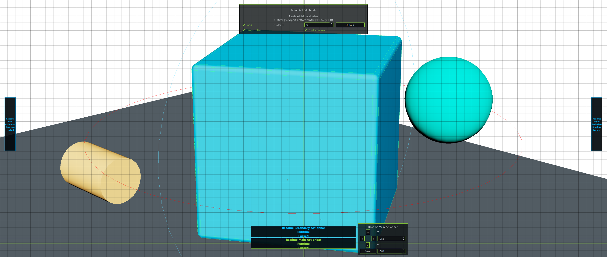

# Edit Mode

Edit Mode is ActionRail's global authoring state for inspecting and adjusting
viewport rail layouts. Normal Mode executes rail actions; Edit Mode draws an
edit-only layout map over the active Maya viewport so rails can be selected and
positioned without triggering their buttons.

The Edit Mode shell and Phase 2 step 2.5 layout persistence/direct
manipulation surface are implemented and Maya-smoke verified. Phase 2 step 2.6
has started: frame options now toggle real collapsible edge-tab state instead
of the earlier opacity-only placeholder, and the first collapse path is
Maya-smoke verified. The current 2.6 polish pass also improves collapsed-handle
edge placement and hit targets. Guide/slot-affordance work now draws
axis-aligned Sticky Frames guides and changes slot editing to stable slot
containers: key labels stay on the slot, while the action payload can be
assigned, moved, swapped, or cleared. The latest Edit Mode smoke covers this
behavior in Maya.

## What It Shows

When Edit Mode is enabled, ActionRail draws:

- a viewport-sized layout-map overlay owned by Maya's main window
- an optional placement grid
- one translucent labeled frame for each active runtime rail
- selected-frame styling
- drag handles, anchor pins, selected-frame guide lines, and axis-aligned
  Sticky Frames alignment guides
- rail source layer and lock state labels
- a compact Edit Mode panel with Grid, Grid Size, Snap to Grid, Sticky Frames,
  and selected lock-state display
- a selected-rail position popover with arrow nudges, numeric X/Y controls, and
  Reset

The frame view represents rail footprints and hit boxes. It is deliberately not
the Normal Mode button rendering.



## Maya Workflow

Install the ActionRail Maya menu, show one or more rails, then toggle Edit Mode:

```python
import actionrail

actionrail.install_menu_toggle()
actionrail.show_preset("transform_stack")
actionrail.toggle_edit_mode()
```

The Maya menu exposes `Toggle Edit Mode` after `install_menu_toggle()` is run.

Inside Edit Mode:

- left-click and drag an unlocked rail frame to move it directly
- edit the X/Y fields or use the arrow controls to nudge an unlocked rail
- right-click a rail frame to open options routing for that rail
- select a rail slot to make frame options report the target slot
- drag an action from the frame options action palette onto an unlocked slot to
  replace that slot's payload
- Shift+left-drag a populated unlocked slot to move its payload to another
  slot, or drag it out of the bar to clear it
- use frame options to collapse an edge-anchored rail to a small handle or
  expand it again
- enable Grid to show or hide the edit-only grid
- adjust Grid Size to change the grid spacing
- enable Snap to Grid to snap authoring movement to the grid
- enable Sticky Frames to align moved rails to nearby rail edges
- use Save Position from the right-click options popover, or
  `save_edit_mode_layout()`, to persist an unlocked runtime/user rail as a user
  preset or an unlocked built-in/studio rail as a user override

Movement updates active rail overlay positions immediately. Saved persistence is
implemented for unlocked runtime/user rails by writing the current runtime spec
to the user preset store. Unlocked built-in and studio rail saves write a
separate `*_user_override` user preset; loading the original read-only preset
id applies that sidecar override without mutating bundled or studio JSON.
Locked built-in and studio presets remain read-only.

## Public API

Top-level helpers:

```python
import actionrail

state = actionrail.enter_edit_mode()
state = actionrail.toggle_edit_mode()
state = actionrail.exit_edit_mode()
state = actionrail.edit_mode_state()
state = actionrail.set_edit_mode_options(
    show_grid=True,
    snap_to_grid=True,
    sticky_frames=True,
    grid_size=32,
)
state = actionrail.select_edit_mode_rail("my_user_rail")
path = actionrail.save_edit_mode_layout("my_user_rail")
```

State objects:

- `EditModeSettings`: `show_grid`, `snap_to_grid`, `sticky_frames`,
  `grid_size`
- `EditModeState`: `enabled`, `selected_preset_id`, `settings`, `rail_count`,
  `options_preset_id`, `selected_slot_id`
- `RailFrameInfo`: viewport-local frame geometry, layout metadata, lock state,
  collapse state, and source layer
- `RailSlotInfo`: viewport-local slot geometry, stable slot id, visible label,
  action payload, lock state, and payload-present state

Implementation ownership:

- `scripts/actionrail/edit_mode.py`: state model, layout-map overlay, grid,
  frame/slot selection, options routing, payload assignment/move/clear, and
  rail nudging
- `scripts/actionrail/maya_ui.py`: Maya menu entry point
- `tests/test_edit_mode.py`: pure Python API/model coverage
- `tests/maya_smoke/actionrail_edit_mode_smoke.py`: Maya layout-map,
  selection, movement, sticky-frame, slot-payload editing, right-click routing,
  collapse, and screenshot smoke

## Current Limits

Implemented now:

- global enter/exit/toggle state
- active-rail frame discovery
- grid visibility and grid-size controls
- left-click frame selection
- selected-frame X/Y popover
- X/Y movement for unlocked rails
- drag handles and anchor pins
- snap-to-grid and Sticky Frames during movement
- selected-frame snap/spacing guide rendering with axis-aligned Sticky Frames
  alignment hints
- right-click frame options routing marker
- frame options action palette for replacing selected slot payloads
- stable slot containers where ids and key labels stay fixed while payloads
  move, swap, or clear
- edge-tab collapse/expand control backed by persisted `collapse` settings and
  larger edge-clamped collapsed handles
- Save Position for unlocked runtime/user rails
- Save Position user-overrides for unlocked built-in and studio rails
- public layout-save helper that persists adjusted offsets to user presets
- Maya menu toggle
- Maya screenshot verification

Not implemented yet:

- Bind Mode, flyouts, command rings, profile layers, marking-menu export, and
  Viewport 2.0 drawing

Do not modify locked built-in or studio presets directly when adding
persistence. Save layout changes as user presets or user overrides.

## Verification

Focused smoke:

```powershell
.\scripts\maya-smoke.ps1 -Script actionrail_edit_mode_smoke.py
```

Full Maya-facing baseline:

```powershell
.\scripts\maya-smoke.ps1 -Script all
```

The verified overview screenshot used by the README is stored at
`docs/assets/actionrail_readme_edit_mode.png`.
